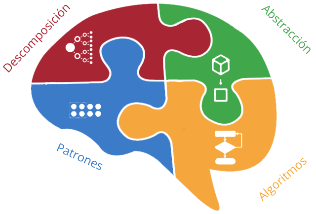
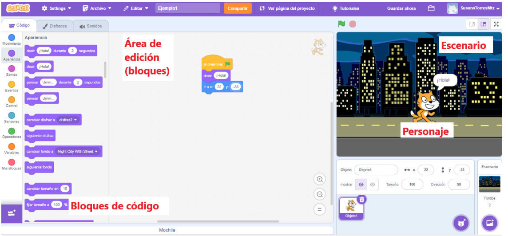

# 1.Introducción al pensamiento computacional

## 1.1.Definición y conceptos básicos de pensamiento computacional

El **pensamiento computacional** es una habilidad cognitiva que implica la resolución de problemas, el diseño de algoritmos y la comprensión de procesos, inspirada en los principios fundamentales de la informática. A través de este enfoque, se pueden abordar problemas de manera lógica y estructurada, independientemente del campo de estudio.

En el año 2006 Jeannette Wing definió y publicó al artículo *[Computational Thinking](https://www.cs.cmu.edu/~15110-s13/Wing06-ct.pdf)* en el cual planteó que: "el pensamiento computacional implica resolver problemas, diseñar sistemas y comprender el comportamiento humano, haciendo uso de los conceptos fundamentales de la informática.

### Elementos clave del pensamiento computacional

- **Descomponer:** consiste en dividir un problema complejo en partes más pequeñas y manejables, cada parte se aborda por separado, facilitando así la comprensión y la resolución eficiente del problema general.

- **Reconocimiento de patrones:** implica identificar similitudes, tendencias o características recurrentes en los datos o problemas. El reconocimiento de patrones ayuda a simplificar la comprensión y a desarrollar soluciones más efectivas.

- **Abstracción:** se refiere a la capacidad de enfocarse en los detalles esenciales mientras se ignoran los aspectos no esenciales. La abstracción permite crear modelos y representaciones simplificadas de problemas complejos.

- **Algoritmos:** son los pasos definidos y ordenados que llevan a la solución de un problema.

## 1.2.Importancia y aplicación en la resolución de problemas

Existen varios factores por los cuales el pensamiento computacional es de gran importancia y puede ser aplicado en diferentes ámbitos y disciplinas. Entre ellos podemos enlistar:

- **Eficiencia en la resolución de problemas:** ya permite descomponer problemas complejos en partes más pequeñas y manejables, facilitando la identificación y solución eficiente de cada componente.

- **Aplicabilidad universal:** es una habilidad que se puede aplicar en diversas disciplinas y situaciones, no solo en programación. Desde la ciencia y la ingeniería hasta la toma de decisiones cotidianas.

- **Promoción del razonamiento lógico:** fomenta un enfoque lógico y sistemático para abordar problemas, lo que mejora la toma de decisiones y la capacidad de razonar de manera ordenada.

- **Innovación y creatividad:** el pensamiento computacional no solo trata de resolver problemas, sino también de encontrar soluciones creativas. Facilita la generación de ideas innovadoras y la creación de nuevas soluciones.

- **Preparación para la era digital:** en un mundo cada vez más digital, el pensamiento computacional es una habilidad fundamental para comprender y participar de manera efectiva en la tecnología y la informática.

- **Desarrollo de habilidades analíticas:** promueve la capacidad de analizar datos, reconocer patrones y extraer información valiosa, lo que es crucial en campos como la ciencia de datos y la analítica.

Como se ha mencionado anteriormente, problemas de diferentes ámbitos y disciplinas pueden ser resueltos más fácilmente al aplicar el pensamiento computacional, entre ellas podemos mencionar algunas como: programación, ciencia de datos, ingeniería, educación, toma de decisiones empresariales, resolución de problemas cotidianos e investigación científica.  

**En resumen, el pensamiento computacional es una habilidad versátil y valiosa que mejora la capacidad de abordar problemas de manera efectiva en una variedad de campos. Su aplicación va más allá de la programación y es esencial para prosperar en la era digital actual.**

## 1.3.Introducción a Scratch

**Scratch** es un entorno de programación visual diseñado para introducir a personas de todas las edades en los conceptos fundamentales de la programación de una manera lúdica y creativa.

Desarrollado por el Grupo Lifelong Kindergarten del MIT Media Lab, Scratch permite a los usuarios crear proyectos interactivos, animaciones y juegos sin tener que escribir código en un lenguaje de programación convencional.

Scratch utiliza una interfaz gráfica de bloques que representan diferentes comandos y funciones. Los usuarios ensamblan estos bloques para crear programas, lo que facilita el aprendizaje de conceptos de programación sin la necesidad de codificación textual además de que facilita la experimentación y la corrección de errores.

Scratch cuenta con una comunidad en línea donde los usuarios pueden compartir sus proyectos, explorar creaciones de otros y aprender unos de otros. La plataforma fomenta la colaboración y la creatividad, y puede ser usado como un programa de escritorio o desde su aplicación web de manera gratuita y en línea.

[Scratch](https://scratch.mit.edu/)

### Interfaz de Scratch

Dentro de la interfaz gráfica de Scratch podemos identificar algunos de los elementos más importantes:

- **Área de edición (bloques):** en esta parte del programa se construirán los bloques de código que harán que los personajes y elementos del programa tengan la interacción que el usuario desee aplicar.

- **Bloques de programación:** los bloques de Scratch representan acciones y eventos, como movimientos, repeticiones, decisiones y más. Estos bloques se pueden arrastrar y soltar para construir programas.

- **Personajes y Escenarios:** los proyectos en Scratch involucran personajes (sprites) que pueden ser animados y programados para interactuar entre sí y con el entorno (escenario).

### Beneficios educativos de usar Scratch:
- **Aprendizaje lúdico:** hace que el aprendizaje de la programación sea divertido y accesible, especialmente para principiantes.
- **Desarrollo del pensamiento computacional:** facilita la comprensión de conceptos clave de programación, como la secuenciación, la repetición y la toma de decisiones.

- **Creatividad y expresión:** permite a los usuarios expresar su creatividad mediante la creación de proyectos interactivos, juegos y animaciones.

- **Comunidad de aprendizaje:** la comunidad en línea de Scratch proporciona un entorno de aprendizaje colaborativo donde los usuarios pueden compartir, inspirarse y aprender de los demás.