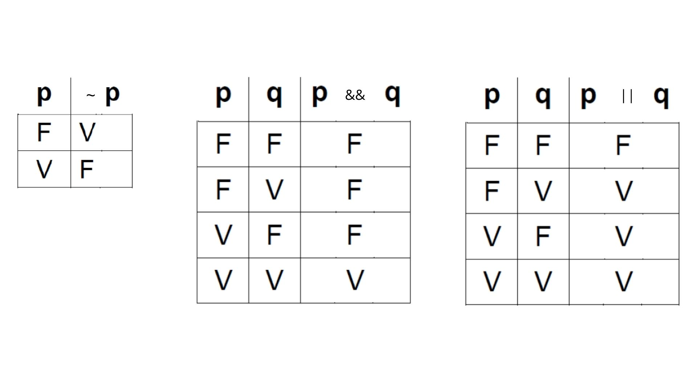
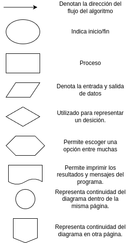

# 2.Algoritmos y resolución de problemas

## 2.1.Entendiendo qué es un algoritmo y los tipos de algoritmos

Un **algoritmo** es una serie finita y ordenada de pasos bien definidos que describe la solución a un problema o la realización de una tarea específica. Los algoritmos son fundamentales en la informática y la ciencia de la computación, ya que proporcionan la base para el diseño de programas y la resolución de problemas.

### Principales características de un algoritmo

- **Precisión:** cada paso del algoritmo debe estar definido de manera clara y sin ambigüedades.

- **Finitud:** un algoritmo debe tener un número finito de pasos. No puede ser infinito, ya que debe llegar a una solución en un tiempo finito.

- **Entrada y salida bien definidas:** el algoritmo debe tener parámetros de entrada claramente definidos, y su ejecución debe producir resultados específicos como salida.

- **Efectividad:** debe ser efectivo en términos de resolver el problema para el cual fue diseñado.

- **Generalidad:** debe ser lo suficientemente general como para aplicarse a diferentes instancias del mismo tipo de problema.

*Ejemplo de algoritmo*

Situación a resolver: lavado de manos

1. Abrir la llave del agua.
2. Mojarse las manos.
3. Aplicar jabón.
4. Frotar las manos durante 20 segundos.
5. Enjuagar el jabón con agua.
6. Cerrar la llave del agua.
7. Secarse las manos.

### Ventajas de los algoritmos

- **Estructura Organizada:** los algoritmos proporcionan una estructura clara y organizada para la solución de problemas.

- **Reusabilidad:** al seguir un conjunto de pasos y acciones similares o adaptados para abordar problemas relacionados.

- **Eficiencia y optimización:** los algoritmos pueden ser diseñados para ser eficientes y optimizar el uso de recursos.

- **Automatización:** facilitan la automatización de tareas, permitiendo que las computadoras realicen procesos de manera sistemática.

- **Claridad y comprensión:** ayudan a comprender y comunicar la solución a un problema de manera clara y lógica.

### Desventajas de los algoritmos

- **Limitaciones en problemas complejos:** algunos problemas complejos pueden no tener soluciones algorítmicas eficientes o pueden requerir algoritmos muy complicados.

- **Dependencia del diseñador:** la calidad y eficacia de un algoritmo dependen en gran medida de las habilidades y la experiencia del diseñador.

- **Cambios en los requisitos:** los algoritmos pueden volverse obsoletos o necesitar modificaciones significativas si hay cambios en los requisitos del problema.

- **Imposibilidad de resolver algunos problemas:** existen problemas para los cuales no se ha encontrado un algoritmo que pueda resolverlos de manera eficiente.

- **Tiempo de desarrollo:** la creación de algoritmos efectivos puede llevar tiempo y esfuerzo, especialmente para problemas complejos.

### Tipos de algoritmos

Los algoritmos pueden clasificarse en **cualitativos** y **cuantitativos**. Los algoritmos cualitativos se utilizan para listar los pasos a seguir en actividades diarias cómo preparar una bebida, cepillarse los dientes, entre otros, mientras que los algoritmos cuantitativos implican cálculos numéricos, por ejemplo, calcular el finiquito de un empleado, calcular el cambio de la compra de un producto, obtener la raíz cuadrada de un número.

## 2.2.Datos y tipos de datos

Los datos básicamente son representaciones simbólicas (numéricas, caracteres, valores lógicos, etc.) de un determinado atributo o variable cualitativa o cuantitativa.

Los tipos de datos son fundamentales en la programación ya que permiten describir y manipular de manera eficiente diferentes tipos de información.

Los datos se clasifican principalmente en **primitivos o simples** y **compuestos**.

Un dato **primitivo** es una abstracción del mundo real (como por ejemplo un número entero, carácter, un valor lógico, etc.), los cuales pueden ser representados internamente por la computadora.

Podemos subclasificar este tipo de datos en:
- **Numéricos:**  abarcan tanto los tipos enteros (int) y los tipo punto flotante (float).
- **Tipo carácter (char):** unidad básica e indivisible de las cadenas.
- **Lógicos o Booleanos (bool):** están formados por dos valores: Verdadero (True) y Falso (False). 

Los datos compuestos se caracterizan por el hecho de estar estructurados por varios datos simples.
- **Cadena (string)**
- **Arreglos**
- **Entre otros**

### 2.2.1.Constantes

Las constantes son datos que no cambian durante la ejecución del programa. Existen constantes de todos
los tipos de datos.

### 2.2.2.Variables

Son objetos que pueden cambiar su valor durante la ejecución de un programa.

Hay dos tipos de variables:
- Globales: se escriben al comienzo del programa.
- Locales: Se declaran dentro de un bloque de instrucciones del programa.

Los datos que procesa una computadora, ya sean simples o compuestos, se deben almacenar en celdas de memoria para utilizarlos posteriormente. A estas celdas de memoria se les asigna un nombre para reconocerlas, es decir, un **identificador**.

Para formar un identificador existen una serie de reglas básicas:
- Debe comenzar con una letra (A a Z, mayúsculas o minúsculas) y no deben contener espacios en blanco.
- Dígitos y caracteres están permitidos después del primer carácter.
- Se debe de excluir el uso de palabras reservadas.

## 2.3.Operadores

Los operadores son necesarios para realizar operaciones. Distinguimos entre operadores aritméticos, relacionales y lógicos.

### 2.3.1.Aritméticos

Nos permiten realizar operaciones entre operandos: números, constantes o variables. El resultado de una operación aritmética siempre es un número. Entre ellos podemos encontrar a la suma, resta, multiplicación, división, potencias, entre otras, y se utilizan en algoritmos cuantitativos para encontrar la solución a un problema.

| Nivel jerárquico | Operador |
| ---------------- | -------- |
|        0         |    ()    |
|        1         |     ^    |
|        2         |   *  /   |
|        3         |  mod %   |
|        4         |   + -    |

Ejemplo: X = (3^2 + 10/2) + (3*9 mod 4 – 1)

### 2.3.2.Relacionales

Los operadores relacionales se utilizan para comparar dos o más valores y determinar si el resultado es falso o verdadero:

| Operador | Operación |
|--------- | --------- |
|     <    | Menor que |
|     >    | Mayor que |
|     <=   |Menor o igual|
|    >=    |Mayor o igual|
|  <> o != | Diferente |
|     ==    |  Igual a  |

### 2.3.3.Lógicos

Los operadores lógicos se utilizan para evaluar dos o más expresiones que utilizan operadores relacionales para determinar si la expresión en general es verdadera o falsa.
Los operadores lógicos son: conjunción o AND que se representa con (&&) y disyunción u OR que se representa  (||). El operador negación o NOT que se representa con el símbolo ~ o !. 

## 2.4.Diseño de algoritmos simples

Se refiere al proceso de concepción y planificación de procedimientos básicos y fácilmente comprensibles para abordar tareas específicas o resolver problemas simples.

### Características del Diseño de Algoritmos Simples:

- *Claridad y Sencillez:* los algoritmos simples deben ser fáciles de entender y seguir. La simplicidad ayuda a reducir la complejidad y facilita la implementación y mantenimiento.

- *Estructura Secuencial:* en muchos casos, los algoritmos simples siguen una estructura secuencial, donde las instrucciones se ejecutan en orden, uno tras otro.

- *Entrada y Salida Definidas:* especificar claramente los datos de entrada que el algoritmo necesita y los resultados que debe producir.

- *Operaciones Básicas:* utilizar operaciones y conceptos básicos para construir el algoritmo. Esto puede incluir aritmética simple, comparaciones, bucles y estructuras condicionales.

- *Eficiencia Relativa:* aunque la eficiencia no es tan crítica en algoritmos simples, aún se debe buscar un diseño que evite redundancias y realice la tarea de manera efectiva.

## 2.5.Diagrama de flujo y diseño de diagrama de flujo

El análisis de un problema y la construcción de los algoritmos para solucionarlo, implican un proceso lógico que puede efectuarse de forma individual o grupal. Éste sólo es el primer paso de la solución, posteriormente debe revisarse para encontrar posibles errores u omisiones en la misma, pedir el punto de vista de otras personas y finalmente llevar a cabo el algoritmo. Cada una de estas acciones necesita, generalmente, comunicar el algoritmo a otras personas.

En este caso, la comunicación oral del algoritmo es poco práctica porque se presentan problemas derivados de la diferencia de conceptos e incluso omisión de detalles. Por ello la mejor opción es utilizar herramientas que permitan plasmar en un lenguaje común la solución. Una de las herramientas más utilizadas para representar los algoritmos son los diagramas de flujo.

Los diagramas de flujo se utilizan para describir gráficamente un algoritmo, y su simbología muestra la solución de un problema con una trayectoria de inicio a fin.

### Proceso de resolución de problemas

