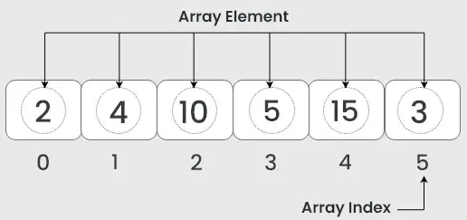
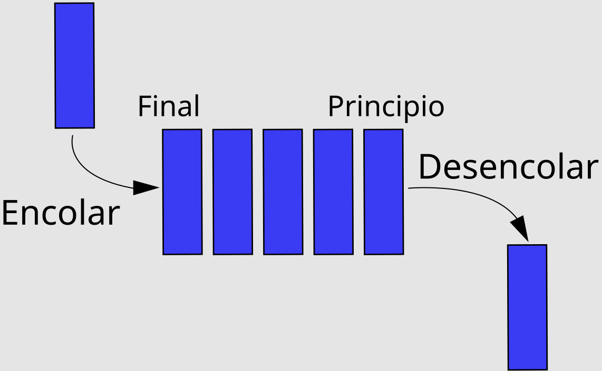
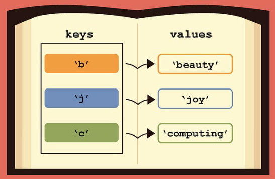
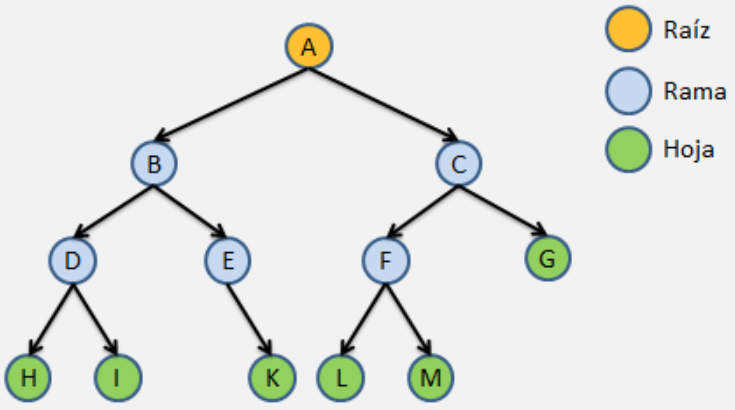
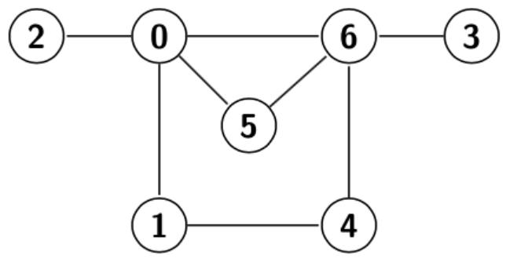

# 3.Estructuras de datos fundamentales

Las estructuras de datos son formas de organizar y almacenar datos en la memoria de una computadora para su posterior manipulación. Al elegir la estructura de datos adecuada, podemos optimizar el rendimiento de nuestros programas y ahorrar tiempo y recursos. Algunas de las estructuras de datos más comunes son: **listas**, **colas**, **pilas**, **arreglos**, **árboles**, **diccionarios** y **grafos**. Estas estructuras de datos son esenciales en la programación y cada una tiene sus propias ventajas y desventajas en términos de eficiencia y uso. La elección de la estructura de datos adecuada depende del problema que estás resolviendo y de los requisitos específicos de tu aplicación.

## 3.1Introducción a estructuras 

En muchas situaciones se necesita procesar una colección de valores que están relacionados entre sí por algún método, por ejemplo, una lista de calificaciones, una serie de temperaturas medidas a lo largo de un mes, etc. El procesamiento de tales conjuntos de datos, utilizando datos simples, puede ser extremadamente difícil y por ello la mayoría de los lenguajes de programación incluyen características de estructuras de datos.
Algunas de las estructuras de datos básicas que soportan la mayoría de los lenguajes de programación son:

## 3.2Uso de estructuras de datos en la organización y manipulación de información

El uso de estructuras de datos es esencial en la organización y manipulación eficiente de la información en programación. A continuación, se presentan algunas de las estructuras de datos más comunes y cómo se aplican en la gestión de datos:

- **Lista:** es una estructura de datos que almacena elementos en un orden específico. Puede contener elementos de diferentes tipos y permite la inserción, eliminación y acceso a elementos de manera flexible. En muchos lenguajes de programación, las listas son dinámicas, lo que significa que pueden cambiar de tamaño durante la ejecución del programa. Ejemplo: `miLista = [1,2,3,4,'cinco']`

- **Arreglos (Arrays):** es una estructura de datos que almacena elementos del mismo tipo en posiciones de memoria contiguas, como listas de calificaciones, nombres o cualquier conjunto de datos donde la posición es importante. A diferencia de las listas, los arreglos suelen tener un tamaño fijo.

- **Pilas (Stacks):** son estructuras de datos de tipo LIFO (Last In, First Out) donde el último elemento agregado es el primero en ser eliminado. Se aplican en situaciones donde es necesario rastrear operaciones en reversa, como la operación "deshacer" en editores de texto.

- **Colas (Queues):** las colas son estructuras de datos de tipo FIFO (First In, First Out) donde el primer elemento agregado es el primero en ser eliminado. Se utilizan para gestionar operaciones en un orden específico, como la administración de tareas en un sistema de procesamiento por lotes.

- **Diccionarios (Hash Tables):** es una estructura de datos que almacena pares clave-valor. Permite la asociación de un valor con una clave única, facilitando la búsqueda eficiente de datos. Los diccionarios son conocidos por diferentes nombres en varios lenguajes, como "maps" o "hash tables". Son ideales para representar conjuntos de datos donde es crucial la búsqueda rápida de información, como en sistemas de gestión de bases de datos.

- **Árboles (Trees)**: son estructuras de datos jerárquicas con nodos conectados por relaciones de padre e hijo. Se aplican cuando se necesita representar relaciones jerárquicas, como la estructura de carpetas en un sistema de archivos.

- **Grafos:** son conjuntos de nodos conectados por aristas, permitiendo representar relaciones complejas entre entidades. Se utilizan en situaciones donde es necesario modelar relaciones no jerárquicas, como en redes sociales o sistemas de rutas.

La elección de la estructura de datos adecuada depende de la naturaleza de los datos y las operaciones que se realizan con ellos. Una comprensión sólida de estas estructuras de datos permite a los programadores optimizar la eficiencia y la organización de la
información en sus programas.