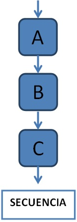
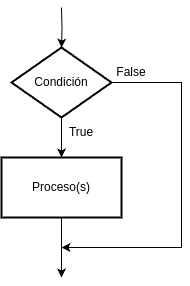
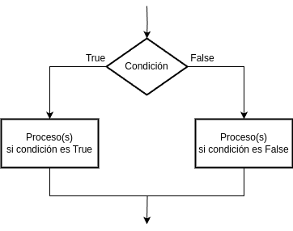
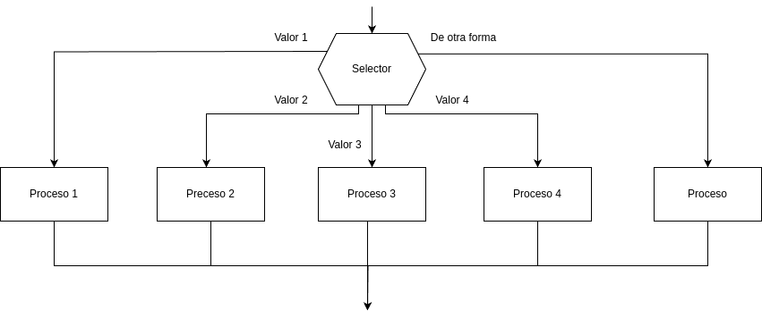
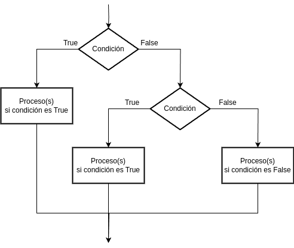

# 4.Pensamiento Lógico y Condicionales
**Pensamiento Lógico**
Es una habilidad fundamental que involucra la capacidad de razonar y resolver problemas de manera coherente y consistente. Se refiere también a la capacidad de entender el mundo que nos rodea y las relaciones que existen entre diferentes acciones, objetos o eventos mediante procesos de análisis, comparación, abstracción y, en ocasiones, incluso la imaginación.
La **programación lógica**, junto con la funcional, forma parte de lo que se conoce como Programación Declarativa, es decir, la programación **consiste en indicar como resolver un problema mediante sentencias**.

## 4.1.Introducción a la lógica en programación
La lógica de programación consiste en la organización y planificación coherente de las instrucciones necesarias para ejecutar con éxito un programa. Dentro de ello hay una serie de patrones que se repiten en todos los lenguajes, como el uso de variables, métodos o funciones, condicionales y bucles.
La lógica es un aspecto fundamental en programación, ya que proporciona las reglas y estructuras que permiten crear algoritmos y tomar decisiones dentro de un programa.
Comprender y aplicar la lógica en programación es esencial para escribir código claro, eficiente y libre de errores. La habilidad para pensar lógicamente y expresar decisiones mediante instrucciones de programación es crucial para el desarrollo de software.

## 4.2. Conceptos de secuenciación y control de flujo
Una estructura secuencial es aquella en la que una acción (instrucción) sigue a otra en secuencia. Las tareas se suceden de tal modo que la salida de una es la entrada de la siguiente y así sucesivamente hasta el final del proceso.

Por otra parte, el término flujo de control se refiere al orden en que se ejecutan las sentencias del programa. 
Las estructuras de control se utilizan para controlar el flujo de un programa, son métodos que permiten especificar el orden en el cual se ejecutarán las instrucciones en un algoritmo. Si no existieran las estructuras de control, los programas se ejecutarían linealmente desde el principio hasta el fin, sin la posibilidad de tomar decisiones.

Por lo general, en la mayoría de lenguajes de programación encontraremos dos tipos de estructuras de control. Encontraremos un tipo que permite la ejecución condicional de bloques del programa y que son conocidas como **estructuras condicionales**. Por otro lado, encontraremos las **estructuras iterativas** que permiten la repetición de un bloque de instrucciones, un número determinado de veces o mientras se cumpla una condición.

## 4.3. Uso de condicionales (if, if-else, switch) para la toma de decisiones en código
Las estructuras algorítmicas condicionales o selectivas principales y que se analizarán son las siguientes: **if**, **if-else** y **switch**.

- **Estructura selectiva simple *if* (si):** ejecuta una determinada acción cuando se cumple una determinada condición. La elección if evalúa la condición y si la condición es verdadera, entonces ejecuta la acción u operaciones (o acciones en caso de ser una acción compuesta y constar de varias acciones), si la condición es falsa, entonces no hacer nada.
Las representación gráfica de la estructura condicional simple es la siguiente:

- **Estructura selectiva doble *if-else* (si-sino):** es una estructura que permite elegir entre dos opciones o alternativas posibles, en función del cumplimiento o no de una determinada condición. Si la condición es verdadera, se ejecuta una acción y, si es falsa, se ejecuta la otra acción.
Las representación gráfica de la estructura condicional doble es la siguiente:

- **Estructura selectiva múltiple *switch*:** con frecuencia es necesario que existan más de dos elecciones posibles. Este problema, como se verá más adelante, se podría resolver por estructuras simples o dobles, anidadas o en cascada; sin embargo, este método si el número de alternativas es grande puede plantear serios problemas de escritura del algoritmo y naturalmente de legibilidad. 
La estructura de decisión múltiple evaluará una expresión que podrá tomar n valores distintos, 1, 2, 3, 4, ..., n. Según que elija uno de estos valores en la condición, se realizará una de las n acciones, o lo que es igual, el flujo del algoritmo seguirá un determinado camino entre los n posibles.
Es importante señalar que la estructura selectiva switch es muy flexible, lo que permite que se pueda aplicar de diferentes formas. Por ejemplo, si el selector tomará un valor distinto de los comprendidos entre 1 y N, entonces se debe seguir el camino etiquetado con De otra forma o Default.
Las representación gráfica de la estructura switch es la siguiente:

- **Estructuras selectivas en cascada o anidadas:** en el desarrollo de la solución de problemas se encuentran frecuentemente casos en los que, luego de tomar una decisión y señalar el correspondiente camino a seguir, es necesario tomar otra decisión. Este proceso se puede repetir numerosas veces. Una forma de solucionarlo es aplicando estructuras selectivas en cascada. Las representación gráfica de la estructura en cascada o anidada puede ser como la siguiente:

