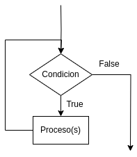
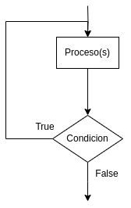
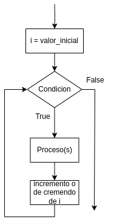

# 5.Secuenciación y bucles

Las computadoras están especialmente diseñadas para todas aquellas aplicaciones en las cuales una operación o conjunto de ellas deben repetirse muchas veces. Un tipo muy importante de estructura es el algoritmo necesario para repetir una o varias acciones un número determinado de veces.
Las estructuras que repiten una secuencia de instrucciones un número determinado de veces se denominan **bucles** y se denomina iteración al hecho de repetir la ejecución de una secuencia de acciones. 
El uso de bucles permite automatizar tareas repetitivas, procesar elementos de una lista o secuencia, continuar la ejecución hasta que se cumpla una condición específica.
Los bucles son esenciales para la eficiencia y la reducción de redundancias en el código, además de que permiten escribir programas más concisos y flexibles.

## 5.1 Uso de estructuras repetitivas o bucles (**for, while y do-while**)

Existen tres tipos de sentencias de tipo bucles while, do-while y for.

- **while (mientras):** es aquella en que el cuerpo del bucle se repite mientras se cumple una determinada condición. Cuando se ejecuta la instrucción while, la primera cosa que sucede es que se evalúa la condición. Si se evalúa falsa, no se toma ninguna acción y el programa prosigue en la siguiente instrucción del bucle. Si la expresión booleana es verdadera, entonces se ejecuta el cuerpo del bucle, después de lo cual se evalúa de nuevo la expresión booleana.
Este proceso se repite una y otra vez mientras la condición sea verdadera. 

- **do-while (hacer-mientras):** 

En ocasiones se necesita que el conjunto de sentencias que componen el cuerpo del bucle se ejecuten al menos una vez sea cual sea el valor de la expresión o condición de evaluación. 
El bucle hacer-mientras es análogo al bucle mientras y el cuerpo del bucle se ejecuta una y otra vez mientras la condición sea verdadera. Existe, sin embargo, una gran diferencia y es que el cuerpo del bucle está encerrado entre las palabras reservadas do-while (hacer y mientras), de modo que las sentencias de dicho cuerpo se ejecutan, al menos una vez, antes de que se evalúe la expresión booleana.

- **For:** en muchas ocasiones se conoce de antemano el número de veces que se desean ejecutar las acciones de un bucle. La estructura for ejecuta las acciones del cuerpo del bucle un número especificado de veces y de modo automático controla el número de iteraciones o pasos a través del cuerpo del bucle.
El ciclo for se compone de tres principales partes:

I. Valor inicial o iniciador: Valor en el que inicia el bucle.

II. Condición: determina cuando se detiene el bucle

III. Incremento o decremento: indica el valor que se le sumará o restará al terminar un ciclo.

Las representación gráfica de la estructura repetitiva for es la siguiente:

