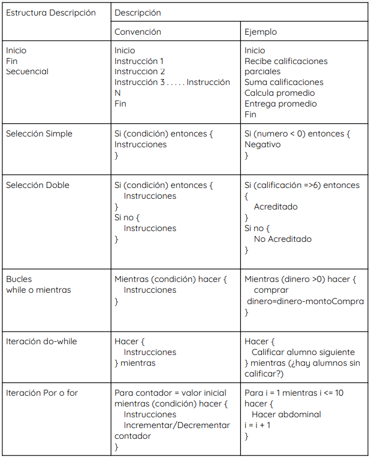

# 6.Introducción a la programación
La programación es un conjunto de instrucciones que le das a una computadora para que realice una tarea específica. Estas instrucciones se escriben en un lenguaje de programación, que es un conjunto de reglas y símbolos que la computadora puede entender y ejecutar.

## 6.1.Conceptos básicos de programación
Cuando realizas una petición a tu equipo de cómputo, (por ejemplo, guardar un documento en el procesador de textos), internamente se ejecutan bloques de instrucciones escritos en un lenguaje de programación que hacen posible las demandas del usuario.

Un **lenguaje de programación** es un idioma artificial creado para indicarle a la computadora lo que debe hacer.

Los lenguajes de programación constan de:
- Un conjunto finito de símbolos, a partir del cual se define el vocabulario del lenguaje.
- Un conjunto finito de reglas (gramática del lenguaje), para la construcción de las sentencias correctas del lenguaje (sintaxis).
- Semántica, que asocia un significado (la acción que debe llevarse a cabo) a cada posible construcción del lenguaje.

Ejemplo

Sintaxis:

`cosole.log("Hola") JavaScript`

`system.out.print("Hola") Java`

`printf("Hola") C`

`print("Hola") Python`

Semántica: imprimir en pantalla el mensaje Hola. 

Un **programa** es un bloque de instrucciones (código fuente) escritas en cierto lenguaje de programación que le indican a la computadora lo que debe hacer y cuyo propósito es resolver un problema.
Para ejecutar un programa la computadora realiza una traducción de sus componentes al lenguaje máquina, es decir, convierte las instrucciones en cadenas de ceros y unos.
Este proceso de conversión puede hacerse de dos formas:
- **Intérprete:** traduce y ejecuta instrucción por instrucción, ejemplos de lenguajes interpretados: Python, Ruby, JavaScript.
- **Compilador:** toma al bloque de instrucciones, lo traduce sólo una vez y lo ejecuta. 
Ejemplos: C, C++, Fortran, Java.

También es importante considerar que cada lenguaje maneja de forma diferente los datos y según esto los lenguajes de programación pueden clasificarse en:

- **Lenguajes tipados:** son los que exigen que se declare el tipo de dato en las variables, estructura de datos o funciones.
- **Lenguajes no tipados** no se necesita declarar el tipo de dato, sino que el intérprete (o el compilador) lo deduce.

## 6.2.Paradigmas de programación

Por paradigma se entiende una de tantas formas en que se pueden hacer las cosas. En el ámbito de la programación, un paradigma es un conjunto de principios que define un enfoque particular para diseñar, estructurar y escribir código. Cada paradigma impone una forma única de pensar sobre cómo debería desarrollarse el código y cómo interactúan sus componentes.

Algunos de los paradigmas de programación más importantes son:
- **Programación imperativa:** en la programación imperativa, se describen detalladamente los pasos que debe seguir el programa para alcanzar un estado deseado. Los lenguajes de programación como C y Pascal son ejemplos clásicos de este paradigma.

- **Programación declarativa:** la programación declarativa se centra en describir el resultado deseado sin especificar los pasos detallados para llegar allí.

- **Programación estructurada:** este paradigma de programación de software prevé el uso de bucles y estructuras de control.

- **Programación funcional:** se centra en tratar las computaciones como evaluaciones de funciones matemáticas y evita el cambio de estado y datos mutables. Lenguajes como Lisp, Haskell y Erlang son conocidos por seguir este paradigma.

- **Programación orientada a objetos (POO)**: los programas se estructuran alrededor de **objetos**, que son instancias de clases que encapsulan datos y métodos. Este enfoque se basa en conceptos como la encapsulación, la herencia y el polimorfismo. Lenguajes como Java, Python y C++ son conocidos por seguir este paradigma.

- **Programación reactiva:** se centra en construir sistemas que reaccionan automáticamente a cambios en su entorno, mediante la propagación de cambios. RxJava y ReactiveX son bibliotecas que permiten la programación reactiva en lenguajes como Java.

- **Programación concurrente:** La concurrencia, en el contexto de la programación, es la capacidad de descomponer un programa en partes que pueden ejecutarse independientemente unas de otras. En esta línea, la programación concurrente es una técnica en la que dos o más procesos o hilos (threads) de un software se inician, se ejecutan de forma intercalada mediante el cambio de contexto y se completan en un período de tiempo superpuesto gestionando el acceso a recursos compartidos.

## 6.3. Introducción al Pseudocódigo.
De las raíces Pseudo (Supuesto) y Código (Instrucción). El pseudocódigo es un lenguaje para las especificaciones de algoritmos. Permite realizar la narrativa de los pasos que debe seguir un algoritmo para dar solución a un problema determinado. Incluye una serie de convenciones léxicas y gramaticales parecidas a la mayoría de los lenguajes de programación, pero sin llegar a la rigidez de sintaxis de estos ni a la fluidez del lenguaje coloquial. A pesar de que las convenciones no cuentan con un estándar.

Los beneficios que proporciona son:
- Representar de forma fácil operaciones repetitivas complejas.
- Es más sencilla la tarea de pasar de pseudocódigo a un lenguaje de programación formal.
- Si se siguen las reglas de alineación, pueden observarse claramente los niveles en la estructura del programa.

Ejemplo de pseudocódigo:

Programa que haga la suma de dos números:

`Inicio`

`     a=0`

`     b=0`

`     suma=0`

`     Imprime "Ingresa dos números"`

`     leer a, b`

`     Hacer suma=a+b`

`     Imprime "El resultado de la suma de a+b es:" suma`

`Fin`

## 6.4. Introducción a un lenguaje de programación de alto nivel como Scratch.

En términos generales, un lenguaje de programación es una herramienta que permite desarrollar software o programas para computadora. Los lenguajes de programación son empleados para diseñar e implementar programas encargados de definir y administrar el comportamiento de los dispositivos físicos y lógicos de una computadora.

### Clasificación de los lenguajes
- **Lenguaje máquina:** es el sistema de códigos interpretable directamente por un circuito microprogramable, como el microprocesador de una computadora. Un programa de computadora consiste en una cadena de estas instrucciones de lenguaje de máquina. El lenguaje máquina es específico de cada máquina o arquitectura de la máquina, aunque el conjunto de instrucciones disponibles pueda ser similar entre ellas.

- **Lenguajes de bajo nivel:** es el que proporciona poca o ninguna abstracción del microprocesador de una computadora. Consecuentemente, su traslado al lenguaje máquina es fácil. El término *ensamblador* se refiere a un tipo de programa informático encargado de traducir un archivo fuente, escrito en un lenguaje ensamblador, a un archivo objeto que contiene código máquina ejecutable directamente por la máquina para la que se ha generado.

- **Lenguaje de alto nivel:** se caracterizan porque su estructura semántica es muy similar a la forma como escriben los humanos, lo que permite codificar los algoritmos de manera más natural, en lugar de codificarlos en el lenguaje binario de las máquinas, o a nivel de lenguaje. Ejemplos de lenguajes de alto nivel: Java, Python, Fortran, C++.